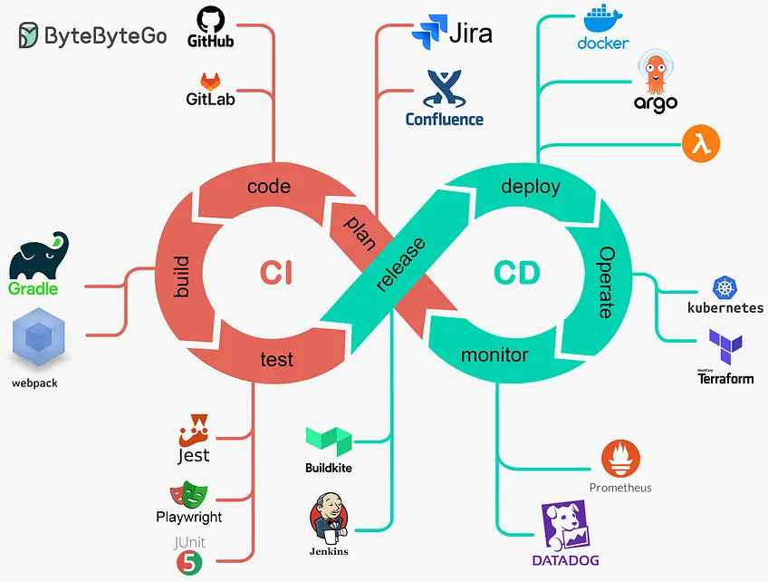

# Lab 1: Yosimar Montenegro - 2023147365

# 📚 Categorías Clave del Desarrollo Web

---

## 1. Frameworks de desarrollo web 💻 

### ¿Qué es un framework y qué problema resuelve?
Un framework es una herramienta de desarrollo web, se define como una aplicación o conjunto de módulos que permiten el desarrollo de aplicaciones mediante aportación de librerías y funcionalidades ya creadas. Básicamente, ayuda al desarrollador a **reutilizar elementos** de aplicaciones concurrentes para facilitar la construcción de aplicaciones.

### Arquitectura general y enfoque (MVC, SPA, SSR, etc.)
Angular tiene una arquitectura MVC completa pero estructurada en los siguientes componentes:

* **Módulos:** `AppModule` es el módulo principal de la aplicación Angular que gestiona el proceso de arranque.
* **Componentes:** Cada componente representa una clase que contiene la lógica y los datos de una parte específica de la interfaz de usuario.
* **Plantilla:** La plantilla combina el código de Angular con HTML para modificar los elementos HTML antes de ser mostrados en la página.
* **Metadatos:** Son un conjunto de instrucciones que se proporcionan a una clase, esto ayuda a que Angular comprenda cómo debe gestionar y usar la clase.
* **Servicios:** Es una clase de servicio en la que se comparten datos o lógicas entre varios componentes de Angular.
* **Inyección de Dependencia:** Permite que los componentes se concentren en su funcionalidad principal al delegar tareas como obtener datos del servidor o hacer validaciones de entrada de usuario.
* **Directivas:** **Directivas estructurales**, que modifican la estructura de la vista, y **Directivas de atributos**, las cuales cambian el estilo de la vista.

### Ejemplo práctico documentado
La estructura de un proyecto en Angular sigue la siguiente organización:

* `src`: Aquí están los archivos fuente de la aplicación Angular, componentes, módulos, servicios y assets.
* `node_modules`: Contiene las dependencias del proyecto, instaladas a través de `npm` o `yarn`.

### Comparación breve entre al menos dos frameworks
* **Vs Vue:** Angular es más robusto y completo, ideal para apps complejas. Vue es ligero y flexible, perfecto para desarrollo ágil. Angular utiliza **TypeScript**, mientras que Vue usa **JavaScript**.
* **Vs Next.js:** Next.js es considerado un framework de React enfocado en **rendimiento y renderizado del lado del servidor (SSR)**. Angular es más enfocado en un desarrollo completo y seguro, para construir apps complejas y escalables.

---

## 2. Control de versiones y trabajo colaborativo 🤝 

### ¿Qué es el control de versiones y por qué es esencial?
Un control de versiones es una herramienta que realiza el seguimiento de modificaciones o cambios en el código fuente a lo largo del tiempo. Esto permite una colaboración rápida entre desarrolladores y a la vez conserva la integridad del código.

### Conceptos clave de Control de Versiones
* **Repositorio:** Almacenamiento digital centralizado donde los desarrolladores administran los cambios en el código.
* **Commit:** Punto donde se guarda el estado actual de los archivos para poder volver a él en el momento que se requiera.
* **Branch (Rama):** Espacio de trabajo aislado para experimentar, construir o probar cambios sin afectar un estado principal de la aplicación.
* **Merge (Fusión):** Proceso en el cual se unen los cambios de una rama en otra.
* **Pull Request:** Propuesta para fusionar cambios realizados en una rama de un repositorio en otra.

### Flujos de trabajo comunes
* **Git Flow:** Hace uso de varias ramas características y múltiples ramas principales. Ideal en DevOps por entregas continuas.
* **Trunk Based:** Los desarrolladores fusionan actualizaciones frecuentes y menores a una rama principal llamada tronco.
* **Feature Branches:** Cada desarrollador crea una rama nueva cuando empieza a trabajar en una nueva característica.

### Uso correcto de Git en un proyecto
Para usar Git de manera correcta primero se debe inicializar el repositorio, luego se realizan cambios con mensajes descriptivos y se pueden crear ramas para trabajar de forma organizada.

* **Inicialización:** `git init` para crear un nuevo repositorio.
* **Comandos Básicos:**
    * `git status`: Muestra el estado del repositorio.
    * `git add <archivo>`: Añade un archivo al área de preparación.
    * `git commit -m "Mensaje"`: Crea un commit.
    * `git log`: Muestra el historial de commits.
* **Ramas:**
    * `git branch`: Lista las ramas.
    * `git branch <nombre rama>`: Crea una rama nueva.
    * `git checkout <nombre rama>`: Cambia a una rama.
    * `git merge <nombre rama>`: Fusiona la rama especificada con la actual.

### Herramientas recomendadas para Git
* **GitHub, GitLab y BitBucket:** Servicios de hospedaje para colaborar y administrar el control de versiones.
* **GitHub Desktop, Sublime Merge:** Herramientas de GUI para una visualización más práctica de los repositorios.

---

## 3. Autenticación y seguridad moderna 🔒 

### Conceptos Clave de Autenticación y Seguridad en la Web
* **Autenticación:** Proceso en el que se verifica que ciertas credenciales tengan acceso al sistema.
* **Autorización:** Capa de filtrado que define los permisos específicos que tiene un usuario en el sistema.
* **Tokens:** Identidad única que representa un permiso o que permite distinguir de cierta manera usando IDs.
* **JWT (JSON Web Token):** Estándar abierto para transmitir información de manera segura entre partes como un objeto JSON.
* **OAuth:** Plataforma de desarrollo utilizada en la verificación de identidad o autenticación.

### Diagrama de flujo explicativo del proceso de autenticación con JWT

### Buenas prácticas en seguridad web
El uso de **contraseñas seguras**, implementar la **autenticación de multifactor** y mantener cautela con enlaces sospechosos son algunas de las prácticas importantes. Para el desarrollo, se debe tener un sistema **sanitizado y validado** para evitar inyecciones XSS o SQL.

### Aplicaciones reales en plataformas modernas
En las plataformas modernas, el uso de JWT y/o OAuth para autenticación y autorización es común. JWT permite crear autenticaciones **sin estado**, mejorando el rendimiento y la escalabilidad.

---

## 4. Gestores de contenido desacoplados (Headless CMS) 🧠 

### Definición de Headless CMS vs CMS tradicional
* **CMS Headless:** Un repositorio que entrega el contenido a cualquier interfaz de usuario. Separa la administración y el almacenamiento de la interfaz.
* **CMS Tradicional:** Unifica la capa de contenido con el frontend, ejecutándose en la misma plataforma. Ejemplos populares son WordPress y Drupal.

### Arquitectura basada en APIs
Permite separar la capa de contenido del backend del frontend. Con esto se eliminan restricciones sobre dónde y cómo publicar el contenido, permitiendo a las organizaciones mostrar el contenido en diferentes aplicaciones a la vez.

### Ventajas, limitaciones y casos de uso comunes
* **Ventajas:** No requiere conocimiento técnico extenso, reduce el tiempo y costo de implementación, y mantiene una coherencia visual con plantillas predefinidas.
* **Limitaciones:** Son blancos de ciberdelincuentes, pueden limitar el diseño personalizado y a veces el rendimiento puede ser bajo.
* **Casos de uso:** Sitio web corporativo, blog personal o tiendas en línea (como Shopify).

### Conexión de Frontend a un CMS Headless
1.  **El usuario entra al sitio web:** Se hace una petición `GET`.
2.  **Cargar el contenido del CMS:** Se usa una API con una petición `GET` por HTTP.
3.  **El CMS headless recibe la solicitud:** Los datos se buscan y se envían.
4.  **El frontend recibe los datos:** Los datos llegan en un JSON y se usan para renderizar la interfaz.

---

## 5. Pasarelas de pago en aplicaciones web 💳 

### ¿Qué es una pasarela de pago? ¿Qué rol cumple en una aplicación moderna?
Las pasarelas de pago actúan como **intermediario** entre un cliente, comercio y una entidad financiera. Permiten a los usuarios realizar compras o pagos de manera rápida y segura, evitando exponer información bancaria directamente en la app.

### Requisitos comunes: cuenta de comercio, seguridad, integración técnica
* **Cuenta de comercio:** Permite a la empresa aceptar pagos con tarjetas de crédito y débito.
* **Seguridad:** Utiliza **cifrado de datos** y **tokenización** para proteger la información financiera.
* **Integración Técnica:** Se usa una **API** para que la pasarela se conecte con la tienda online.

### Ventajas y limitaciones de integrar pagos en línea
* **Ventajas:** Permiten compras desde cualquier lugar, reducen los costos de manejo de efectivo y agilizan el proceso de pago.
* **Limitaciones:** Riesgos de fraude, requiere una infraestructura tecnológica robusta y algunos proveedores cobran **comisiones por transacción**.

### Comparación entre al menos dos pasarelas
| Stripe | Revolut |
|--------|---------|
| Sobresale por tener una **API robusta y documentación exhaustiva**, ideal para desarrolladores. | Ofrece un procesamiento de pago de calidad y **herramientas para gestión de finanzas** empresariales como cambios de divisas. |
| Permite muchos métodos de pago diferentes. | Los clientes pueden pagar directamente con su cuenta Revolut o con tarjeta. |
| Cobra comisiones por transacción. | Tiene comisiones por transacción mínimas. |

---

## 6. Automatización del despliegue y hosting moderno 🚀 

### ¿Qué es CI/CD y por qué se usa en desarrollo web?
**CI/CD** (Integración Continua/Entrega Continua) es una práctica de desarrollo de software habilitada por la automatización.
* **CI:** Integrar cambios de código en un repositorio varias veces al día.
* **CD:** Automatizar las integraciones de código.
* **Beneficios:** Interacción rápida, código limpio y corrección de errores rápida.

### Hosting estático vs dinámico
| Hosting Estático | Hosting Dinámico |
|------------------|------------------|
| Mismo contenido para todos los usuarios. | El contenido es **variable** y puede cambiar según el usuario. |
| Limitado a lectura. | Hay mayor **interacción**, conexión con base de datos, formularios, etc. |
| Más simple de configurar y mantener. | Más complejo, requiere programación y base de datos. |

### Flujo de despliegue automatizado

1.  **Integración Continua:** Se automatiza la integración de cambios de código de muchos desarrolladores.
2.  **Despliegue Continuo:** Se inicia un proceso de despliegue en un entorno de producción.

### Proceso de despliegue en Netlify
1.  Crear un repositorio en **GitHub**.
2.  Clonar el repositorio localmente y seguir los comandos de Git.
3.  Ingresar al sitio web de **Netlify** y conectar con la cuenta de GitHub.
4.  Seleccionar el repositorio creado y seguir los pasos de despliegue.
5.  Netlify se encarga de desplegar automáticamente la página.

Link de Netlify: `https://illustrious-semolina-bc6bb3.netlify.app/`

---

## 📚 Fuentes

* `https://imaginaformacion.com/tutoriales/como-usar-testing-en-angular-con-jasmine-y-karma`
* `https://www.bigscal.com/blogs/frontend/angular-architecture-concepts-and-patterns/#:~:text=Descripci%C3%B3n%20general%20de%20la%20arquitectura,el%20mantenimiento%20de%20aplicaciones%20complejas.`
* `https://www.wearemarketing.com/es/blog/frameworks-en-el-desarrollo-web-las-mejores-practicas-para-tu-negocio-online.html#`
* `https://unity.com/es/topics/what-is-version-control`
* `https://www.jwt.io/introduction#what-is-json-web-token`
* `https://www.weareplanet.com/es/blog/que-es-auth0#:~:text=Auth0%20es%20una%20plataforma%20que,a%20sitios%20web%20y%20aplicaciones.`
* `https://medium.com/@a3rxander/how-to-implement-jwt-authentication-in-laravel-11-26e6d7be5a41`
* `https://frontegg.com/blog/oauth-vs-jwt#:~:text=Ventajas%20de%20JWT,modificados%20por%20clientes%20ni%20atacantes.`