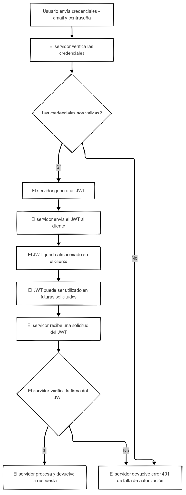

# Categorías Clave del Desarrollo Web
## 1. Frameworks de desarrollo web
### ¿Qué es un framework y qué problema resuelve? 
Framework: Angular
Un framework es una herramienta de desarrollo web, se define como una aplicación o conjunto de módulos que permiten el desarrollo de aplicaciones mediante aportación de librerías y funcionalidades ya creadas. Basicamente ayuda al desarrollador a reutilizar elementos de aplicaciones concurrentes para facilitar la construcción de aplicaciones.

### Arquitectura general y enfoque (MVC, SPA, SSR, etc.). 
Angular tiene una arquitectura MVC completa pero estructurada en los siguientes componentes:

* Módulos: AppModule es el módulo principal de la aplicación angular que gestiona el proceso de arranque.

* Componentes: En una aplicación Angular, cada componente representa una clase que contiene la lógica y los datos de una parte específica de la interfaz de usuario.

* Plantilla: La plantilla combina el codigo de angular con HTML para modificar los elementos HTML antes de ser mostrado en la página.

* Metadatos: Son un conjunto de instrucciones que se proporcionan a una clase, esto ayuda que Angular comprenda como debe gestionar y usar la clase.

* Servicios: Es una clase de servicio en la que se comparten datos o logicas entre varios componentes de Angular.

* Inyección de Dependencia: Las inyecciones de dependencia permiten que los componentes se concentren en su funcionalidad principal al delegar tareas como obtener datos del servidor, hacer validaciones de entrada de usuario, etc.

* Directivas: Directivas estructurales, que modifican la estructura de la vista y Directivas de atributos las cuales cambian el estilo de la vista
### Ejemplo práctico documentado
La estructura de un proyecto en Angular sigue la siguiente organización:

* src: Aqui estan los archivos fuente de la app de Angular, componentes, modulos, servicios y assets (explicado en la sección anterior)

* node_modules: Contiene las dependencias del proyecto, instaladas a través de npm o yam

### Comparación breve entre al menos dos frameworks

Vs Vue: Angular a diferencia de vue es algo más robusto y completo, lo cual lo hace ideal para apps complejas, por otro lado Vue, es ligero y flexible, perfecto para desarrollo agil. Angular utiliza Typescript para su implementación, mientras Vue usa Javascript.

Vs Next Js: Next Js es considerado un framework de React enfocado en rendimiento y renderizado server side, por otro lado, Angular es más enfocado en algo completo y seguro para desarrollo, se pueden construir apps complejas y escalables.

## 2. Control de versiones y trabajo colaborativo

### ¿Qué es el control de versiones y por qué es esencial? 

Un control de versiones es una herramienta que para realizar el seguimiento de modificaciones o cambios que se realizan en el código fuente a lo largo del tiempo. Este permite una colaboración rapida entre desarrolladores y a la vez conserva la integridad del código.

### Conceptos clave de Control de Versiones

#### Repositorio:
Un repositorio es una forma de almacenamiento digital centralizado donde los desarrolladores administran los cambios en el código guente de una aplicación. Algunas características de los repositorios permiten al desarrollador rastrear cambios, editar archivos de manera simultánea y colaborar eficientemente con otras personas en un mismo proyecto desde cualquier ubicación.

#### Commit:
En Git, se le conoce como Commit a un punto donde se requiere guardar el estado actual de los archivos para poder volver a este determinado punto en el momento que se requiere.

#### Branch:
Una rama o branch es un espacio de trabajo aislado de los demás, donde se permite experimentar, construir o probar cambios sin afectar un estado principal de la aplicación. Puede utilizarse para tener varias versiones, trabajar distintas funcionalidades complejas, solucionar errores, etc.

#### Merge:
Un merge o fusión, es un proceso en el cual se unen los cambios de una rama en otra, esto crea una confirmación que integra ambos cambios en un historial. Esto permite que los cambios realizados en una rama puedan estar presentes en otra rama, útil para probar integraciones.

#### Pull Request:
Un pull request es una propuesta para fusionar cambios realizados en una rama de un repositorio en otra, generalmente de una rama de funciones distintas a la rama principal.

### Flujos de trabajo comunes

Los flujos de trabajo en Git son basicamente la manera en la que se define el modelo de ramificación, a continuación se describirán los más comunes:

#### Git Flow:
Hace uso de varias ramas características y múltiples ramas principales, el tener numerosas ramas hace que tenga una duración mayor y con muchas más confirmaciones. Esto requiere de mayor colaboración para fusionar las ramas, ideal en DevOps por entregas continuas.

#### Trunk Based:
En este flujo de trabajo, los desarrolladores fusionan actualizaciones frecuentes y menores para crear una rama principal a la cual se le llama tronco. En este caso se crean ramas de duración corta, esto ayuda a garantizar un flujo fluido de lanzamiento en producción.

#### Feature Branches:
En este caso se utiliza un repositorio central y el master representa un historial oficial en el proyecto, pero en lugar de hacer un commit en la rama master local, cada desarrollador crea una rama nueva cuando empieza a trabajar en una nueva caracteristica.

### Uso correcto de Git en un proyecto

Para usar Git de manera correcta primero se debe inicializar el repositorio, luego se realizan cambios con mensajes descritivos y se pueden crear ramas para trabajar de forma organizada.

#### Inicialización
Para inicializar el proyecto de git se usa el comando `git init` para crear un nuevo repositorio en el directorio actual.

#### Comandos Básicos
`git status` : Muestra el estado del repositorio, archivos por confirmar, archivos modificados, eliminados, etc.

`git add` <archivo> : Añade un archivo al area de preparación, para que sea confirmado luego.

`git commit -m "Mensaje"` : Crea un commit con los cambios que se hayan hecho en los archivos añadidos.

`git log` : Muestra el historial de commits para rastreo.

#### Ramas
`git branch` : Lista las ramas que existen en el repositorio.

`git branch <nombre rama>` : Crea una rama con un numero especifico y esta es basada en la rama actual.

`git checkout <nombre rama>` : Cambia a la rama especifica. 

`git merge <nombre rama>` : Intenta fusionar la rama especificada con la actual.

### Herramientas recomendadas para Git

Al momento de trabajar con Git existe una gran variedad de herramientas para facilitar la gestión de repositorios y otras cosas. A continuación se detallan algunas de las más comunes:

#### GitHub, GitLab y BitBucket:
Son servicios de hospedaje que permiten colaborar con otros y administrar el control de versiones en proyectos.

#### GitHub Desktop, Sublime Merge:
Ambas son herramientas de GUI que buscan dar una visualización más práctica de los repositorios locales y/o conectados con algún servicio como GitHub. Ideal para personas no familiarizadas con el uso de la terminal de comandos.

## 3. Autenticación y seguridad moderna
### Conceptos Clave de Autenticación y Seguridad en la Web

La autenticación y seguridad son puntos importantes en el desarrollo web para proteger los sistemas, información y a los usuarios mismos contra accesos no autorizados o ataques cibernéticos. Para comprender un poco mejor esto se detallarán a continuación algunos de los conceptos importantes de a tomar en cuenta:

#### Autenticación:
La autenticación en apps es un proceso en el que se verifica que ciertas credenciales tengan acceso al sistema o recursos de este mismo. 

#### Autorización:
La autorización es la capa de filtrado en la que pasa un usuario una vez es autenticado, aqui se definen los permisos específicos que tiene en el sistema, con ello se determina que puede y que no puede hacer.

#### Tokens:
Un Token basicamente se refiere a una identidad única que representa un permiso a algún servicio o que permite distinguir de cierta manera usando IDs generalmente siendo cadenas de caracteres autogeneradas.

#### JWT:
JWT es un estándar abierto que define una manera compacta y autónoma de transmitir la información de manera segura entre partes como un objeto JSON. La información puede veriricarse y es confiable por su firma digital.

#### 0Auth:
0Auth es una plataforma de desarrollo web utilizada en la verificación de identifdad o autenticación. Si bien es cierto que se puede desarrollar una solución personal para cada app en cuanto al modulo de autenticado, usar 0Auth asegura tener algo robusto y facil de implementar.

### Diagrama de flujo explicativo del proceso de autenticación con JWT.

### Buenas prácticas en seguridad web.

Hoy en día existen diversas prácticas de ciberseguridad que al implementar aseguramos mantener la integridad tanto de los sitios web como los usuarios. El uso de contraseñas seguras, implementar la autenticación de multifactor, mantener cautela con enlaces sospechosos, entre muchos son algunas de las prácticas importantes que deben tomarse en cuenta tanto en el desarrollo de una app como en su uso.

Especificamente para el desarrollo, se debe tener un sistema sanitizado y validado, para ello cualquier entrada de dato debe ser limpiada para evitar inyecciones XSS o SQL. Además, implementar un control de acceso basado en roles y permisos facilita la restrinccion de privilegios.

### Aplicaciones reales en plataformas modernas.

En las plataformas modernas el uso de JWT y/o 0Auth para autenticación y autorización, ya sea de usuarios o aplicaciones. JWT permite crear autenticaciones sin estado, mejorando el rendimiento y escalabilidad al eliminar la necesidad de almacenar sesiones.

En conjunto, ambas herramientas pueden utilizarse para mejorar la seguridad de las aplicaciones, pues se logra gestionar el flujo de autorizaciones eficientemente. Si bien estas no proporcionan seguridad por si mismas, pueden ayudar a implementar un sistema de autenticado seguro y robusto.

## 4. Gestores de contenido desacoplados (Headless CMS)
### Definición de Headless CMS vs CMS tradicional.

Un CMS headless es un repositorio que permite entregar el contenido a cualquier interfaz de usuario. Es la manera en la que se puede brindar imagenes, articulos, videos y más para mostrarlas en sus aplicaciones. La solución headless permite separar la administración y almacenamiento de la interfaz.

Por otro lado, un CMS tradicional no busca la separación que propone el headless, por otro lado un CMS tradicional unifica la capa de contenido con el frontend, ejecutandose en la misma plataforma. Ejemplos populares de este puede ser WordPRess y Drupal, ambas mantienen tanto el backend como el frontend en una misma plataforma.

### Arquitectura basada en APIs.

Las arquitecturas basadas en APIs que se conectan a sistemas de gestión de contenido permiten separar la capa de contenido del backend del frontend. Con esto se eliminan restrincciones sobre donde y como publicar el contenido, de esta forma las organizaciones pueden mostrar el contenido en diferentes aplicaciones a la vez sin duplicar información, ya que se logra tener una conexión simultanea a un mismo CMS desde múltiples aplicaciones o dispositivos.

### Ventajas, limitaciones y casos de uso comunes.

#### Ventajas:

* No requiere un conocimiento técnico extenso.

* Reduce el tiempo y costo de implementación.

* La mayoría de CMS permiten un diseño uniforme pues tienen plantillas predefinidas que mantienen una coherencia visual en todas las páginas.

#### Limitaciones:

* Los CMS son blancos de ciberdelincuentes, pues cualquier vulnerabilidad en el núcleo puede afectar a todos los sitios que lo usan.

* Si se quiere un diseño personalizado un CMS no es buena opción, pues puede llegar a limitar el diseño propio de cierta forma.

* Empieza a requerir conocimiento técnico cuando se requieren personalizaciones más complejas.

* El rendimiento en apps basadas en CMS pueden llegar a consumir muchos recursos de servidor, pues a veces es necesario tener una cantidad extensa de plugins o temas personalizados lo que requiere cargarlos uno a uno.

#### Casos de Uso:
El uso de CMS es ideal en casos donde se requiere un sitio web corporativo para una empresa que necesita publicar información sobre productos o servicios de manera regular. Otro uso perfecto es para un Blog personal, pues los CMS permiten crear y gestionar todo de manera sencilla al querer crear nuevas páginas.

Hoy en día existen muchas aplicaciones como Shopify que facilitan la creación de tiendas online, brindando permisos de venta, pedidos y emvios.

### Conexión de Frontend a un CMS Headless

La manera en la que el frontend se conecta a un CMS Headless sigue el siguiente flujo:

1. El usuario entra al sitio web. Al hacer esto se hace uso del método GET el cual busca mostrar el contenido renderizandolo, para ello se trae desde el CMS.

2. Para cargar el contenido del CMS se hace uso de un API bajo una petición GET por HTTP, esta API está conectada con el CMS headless. Haciendo uso de endpoints específicos se logra traer toda la información necesaria.

3. El CMS headless recibe la solicitud y los datos son buscados y enviados para poder usarse de forma dinámica en la interfaz.

4. Una vez el frontend recibe los datos en un JSON y usa la información para renderizarla, creando componentes visuales a gusto.

## 5.| Pasarelas de pago en aplicaciones web
### ¿Qué es una pasarela de pago? ¿Qué rol cumple en una aplicación moderna?

En las aplicaciones modernas se requieren hacer transacciones online de forma segura y sencilla de implamentar, para ello las pasarelas de pago actúan como intermediario entre un cliente, comercio y una entidad financiera. En una aplicación moderna, permite a los usuarios realizar compras o pagos de manera rapida y segura, evitando exponer información bancaria directamente en la app.

### Requisitos comunes: cuenta de comercio, seguridad, integración técnica.

#### Cuenta de comercio:
Esto permite que la empresa pueda aceptar pagos de tarjetas de crédito y débito. Basicamente es un acuerdo entre una empresa y un banco o procesador de pagos que permite el procesamiento de transacciones.

#### Seguridad:
Cuanto se habla de transacciones bancarias la seguridad no puede pasarse por largo pues esta es un pilar fundamental ya que se maneja información financiera sensible. Normalmente se utiliza un cifrado de datos para proteger la información de la tarjeta, tokenización que reemplaza los datos de la tarjeta por identificadores luego de verificarse.

#### Integración Técnica:
Es la forma en la que la pasarela de pago se conecta con la tienda online de una empresa. Normalmente para comunicarse con la pasarela se utiliza un API que permite a los desarrolladores hacer uso del sistema de la pasarela. Se hace usos de webhooks permite avisar a la tienda online el momendo donde la transacción se realiza con éxito.

### Ventajas y limitaciones de integrar pagos en línea.

#### Ventajas:

* Este tipo de pagos permiten al cliente realizar compras desde cualquier lugar y en cualquier momento, esto facilita la compra y aumenta las ventas de una empresa.

* La implementación de pasarelas de pago online reducen los costos pues no requiere el manejo de efectivo evitando la gestión de dinero físico y errores humanos.

* Las pasarelas de pago agilizan el proceso de pago, mejorando el flujo y optimizando procesos financieros.

#### Limitaciones:

* Aunque la seguridad en los pagos online son seguros, pueden existir riesgos de fraudes, filtrado de datos y otros, en especial si no se implementan medidas de seguridad robustas.

* A veces implementar pasarelas de pago online requiere de una infraestructura tecnológica robusta y confiable, lo que necesita en parte mayor cantidad de recursos y una conxión estable cliente-servidor.

* Algunos proveedores de pasarelas de pago cobran una comisión por transacción, que en algunos negocios puede no ser rentable.

### Comparación entre al menos dos pasarelas (ej. Stripe, TiloPay, Bancos, etc.)

| Stripe | Revoult |
|--------|---------|
|    Stripe sobresale por tener una API robusta y documentación exhaustiva, esto permite que los desarrolladores puedan crear soluciones de pago adaptables    |    Revoult ofrece tener un procesamiento de pago de calidad y herramientas para gestion de finanzas empresariales como cambios de divisas, envio de dinero entre otros    |
|    Permite muchos métodos de pago diferentes, como tarjetas de crédito y débido, billeteras digitales y opciones locales para países    |    Los clientes pueden pagar directamente con su cuenta Revoult o con tarjeta     |
|    Cobra comisiones por transacción, puede varias depende del método de pago y país    |    Tiene comisiones por transacción minimas     |

## 6. Automatización del despliegue y hosting moderno
### ¿Qué es CI/CD y por qué se usa en desarrollo web?

CI/CD o Integración Continua/Entrega Continua, es una práctica de desarrollo de software habilitada por la automatización. Basicamente el CI significa integrar cambios de código en un repositorio varias veces al día. CD significa entrega continua lo cual es automatizar las integraciones de código, por otro lado la implementacion continua entrega versiones automaticamente a los usuarios finales.

Algunos de los beneficios de la CI/CD son:

* Interación rápida: Combinar esta práctica con DevOps acelera el desarrollo al automatizar el trabajo manual de validación e implementación de cambios en la base de código.

* Código limpio: La verificación de tantos cambios minimos reduce de manera sustanciosa el riesgo de errores que rompan el código ya hecho.

* Corrección de errores rádia: Estas prácticas facilitan la identificación de errores de código y su corrección es más temprana.

### Hosting estático vs dinámico.

| Hosting Estático | Hosting Dinámico |
|------------------|------------------|
|         Es el mismo contenido para todos los usuarios, no cambia         |         El contenido es variable y puede cambiar depende del usuario         |
|         Normalmente limitada a lectura         |          Hay mayor interacción, conexión con base de datos, formularios, etc         |
|         Son más simples de configurar y mantener         |         Son más complejas, requiere programación y base de datos         |

### Flujo de despliegue automatizado.

1. Integración Continua: En esta fase se automatiza la integración de cambios de código de muchos desarrolladores.

2. Despliegue Continuo: Una vez pasa por pruebas de CI, se inicia un proceso de despliegue en un entorno de producción.

### Documentar el proceso seguido para desplegar la parte 2 del laboratorio

1. Crear un repositorio en GitHub con un nombre descritivo
2. Crear el repositorio local siguiendo los comandos mencionados en la sección 2 de esta documentación.
3. Agregar el repositorio remoto al local, agregar los archivos al repositorio local y hacer un commit en el repositorio remoto.
4. Ingresar al sitio web de Netlify, conectar con la misma cuenta de GitHub que se utiliza para el repositorio creado anteriormente.
5. Seguir los pasos de despliegue seleccionando el repositorio creado.
6. Netlify se encarga de desplegar automaticamente la página.

Link de Netlify: https://illustrious-semolina-bc6bb4.netlify.app/

## Fuentes

https://imaginaformacion.com/tutoriales/como-usar-testing-en-angular-con-jasmine-y-karma

https://www.bigscal.com/blogs/frontend/angular-architecture-concepts-and-patterns/#:~:text=Descripci%C3%B3n%20general%20de%20la%20arquitectura,el%20mantenimiento%20de%20aplicaciones%20complejas.

https://www.wearemarketing.com/es/blog/frameworks-en-el-desarrollo-web-las-mejores-practicas-para-tu-negocio-online.html#

https://unity.com/es/topics/what-is-version-control

https://www.jwt.io/introduction#what-is-json-web-token

https://www.weareplanet.com/es/blog/que-es-auth0#:~:text=Auth0%20es%20una%20plataforma%20que,a%20sitios%20web%20y%20aplicaciones.

https://medium.com/@a3rxander/how-to-implement-jwt-authentication-in-laravel-11-26e6d7be5a41

https://frontegg.com/blog/oauth-vs-jwt#:~:text=Ventajas%20de%20JWT,modificados%20por%20clientes%20ni%20atacantes.